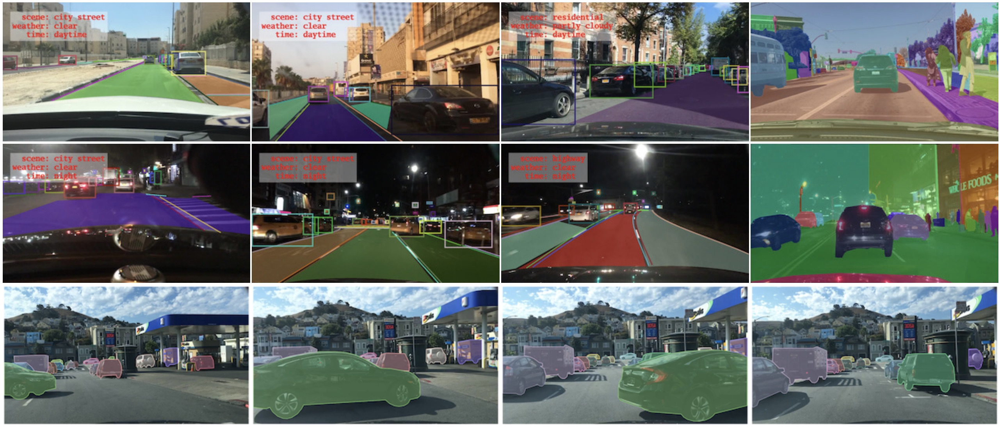
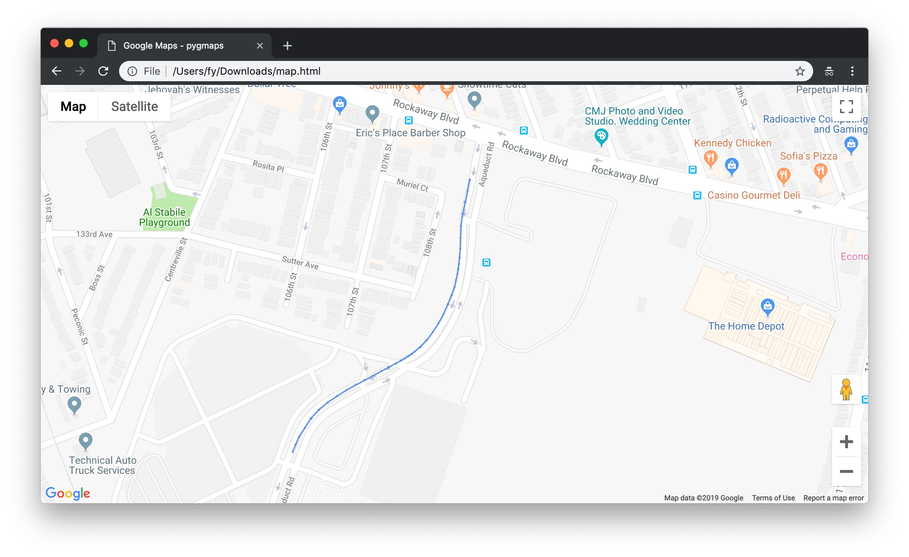

# BDD100K




We construct BDD100K, the largest open driving video dataset with 100K videos and 10 tasks to evaluate the exciting progress of image recognition algorithms on autonomous driving. Each video has 40 seconds and a high resolution. The dataset represents more than 1000 hours of driving experience with more than 100 million frames. The videos comes with GPU/IMU data for trajectory information. The dataset possesses geographic, environmental, and weather diversity, which is useful for training models that are less likely to be surprised by new conditions. The dynamic outdoor scenes and complicated ego-vehicle motion make the perception tasks even more challenging. The tasks on this dataset include image tagging, lane detection, drivable area segmentation, road object detection, semantic segmentation, instance segmentation, multi-object detection tracking, multi-object segmentation tracking, domain adaptation,  and imitation learning. This repo is the supporting code for [BDD100K data](https://arxiv.org/abs/1805.04687) and [Scalabel](https://www.scalabel.ai/). The data downloading is available at [BDD100K data website](https://bdd-data.berkeley.edu/). To cite the dataset in your paper,


```
@InProceedings{bdd100k,
    author = {Yu, Fisher and Chen, Haofeng and Wang, Xin and Xian, Wenqi and Chen, Yingying and Liu, Fangchen and Madhavan, Vashisht and Darrell, Trevor},
    title = {BDD100K: A Diverse Driving Dataset for Heterogeneous Multitask Learning},
    booktitle = {The IEEE Conference on Computer Vision and Pattern Recognition (CVPR)},
    month = {June},
    year = {2020}
}
```


## Dependency

- Python 3
- `pip3 install -r requirements.txt`

## Understanding the Data

After being unzipped, all the files will reside in a folder named `bdd100k`. All the original videos are in `bdd100k/videos` and labels in `bdd100k/labels`. `bdd100k/images` contains the frame at 10th second in the corresponding video.

`bdd100k/labels` contains two json files based on [our label format](doc/format.md) for training and validation sets. [`bdd100k/show_labels.py`](bdd100k/show_labels.py) provides examples to parse and visualize the labels.

For example, you can view training data one by one

```
python3 -m bdd100k.show_labels --image-dir bdd100k/images/100k/train \
    -l bdd100k/labels/bdd100k_labels_images_train.json
```

Or export the drivable area in segmentation maps:

```
python3 -m bdd100k.show_labels --image-dir bdd100k/images/100k/train \
    -l bdd100k/labels/bdd100k_labels_images_train.json \
    -s 1 -o bdd100k/out_drivable_maps/train --drivable
```

This exporting process will take a while, so we also provide `Drivable Maps` in the downloading page, which will be `bdd100k/drivable_maps` after decompressing. There are 3 possible labels on the maps: 0 for background, 1 for direct drivable area and 2 for alternative drivable area.

### Trajectories

To visualize the GPS trajectories provided in `bdd100k/info`, you can run the command below to produce an html file that displays a single trajectory and output the results in folder `out/`:

```
python3 -m bdd100k.show_gps_trajectory \
    -i bdd100k/info/train/0000f77c-6257be58.json -o out/ -k {YOUR_API_KEY}
```

Or create html file for each GPS trajectory in a directory, for example:

```
python3 -m bdd100k.show_gps_trajectory \
    -i bdd100k/info/train -o out/ -k {YOUR_API_KEY}
```

To create a Google Map API key, please follow the instruction [here](https://developers.google.com/maps/documentation/embed/get-api-key). The generated maps will look like




### Semantic Segmentation

At present time, instance segmentation is provided as semantic segmentation maps and polygons in json will be provided in the future. The encoding of labels should still be `train_id` defined in [`bdd100k/label.py`](bdd100k/label.py), thus car should be 13.
